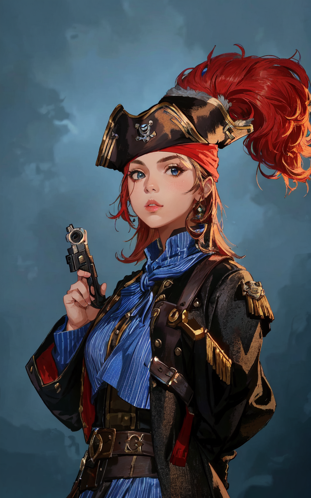

 <table>
  <tr>
    <td rowspan="8"></td>
    <td><b><strong>Stock:</b></strong>Human</td>
  </tr>
  <tr>
    <td><b><strong>Home:</b></strong> The Free Ports of Trord</td>
  </tr>
    <tr>
    <td><b><strong>Age:</b></strong> 23</td>
  </tr>
    <tr>
    <td><b><strong>Height:</b></strong>...</td>
  </tr>
    <tr>
    <td><b><strong>Weight:</b></strong>...</td>
  </tr>
    <tr>
    <td><b><strong>Features:</b></strong>...</td>
  </tr>
   <tr>
    <td><b><strong>Traits:</b></strong> - Disturbingly Confident - Predatory - Problem with Authority - Catalyst - Sea Legs</td>
  </tr>
</table> 

| Beliefs | Instincts |
| ------- | --------- |
| - I will destabilize my rivals in the city to gain control of other crews.  - I will protect Blackport and use any attack as an opportunity to show my strength and build up status of my crew.  - I will build the most powerful mercenary guild in the region. | -Always prepared for confrontation with weapons at the ready in any scenario.  - When faced with difficult tasks, always keep a level head.  - Never accept the words or beliefs of others without question. | 

# Background
A reformed pirate turned mercenary captain. Paolo is attempting to great the largest mercenary band in Racinica.

# Relationships
* [[Adelaide Grimwood]]: A pirate that Paolo was friends with before turning away from the seas
* [[Baldrick Stone]]: A competing mercenary captain to Paolo's outfit