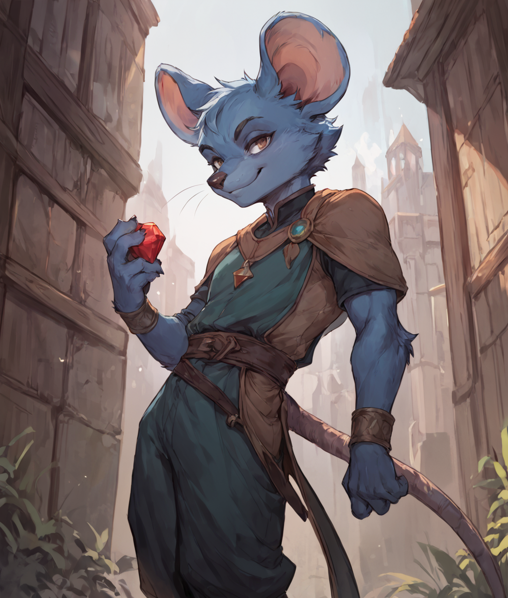

 <table>
  <tr>
    <td rowspan="8"></td>
    <td><b><strong>Stock:</b></strong>Roden</td>
  </tr>
  <tr>
    <td><b><strong>Home:</b></strong> Lou'Toonie (Racinica)</td>
  </tr>
    <tr>
    <td><b><strong>Age:</b></strong> 22</td>
  </tr>
    <tr>
    <td><b><strong>Height:</b></strong>...</td>
  </tr>
    <tr>
    <td><b><strong>Weight:</b></strong>...</td>
  </tr>
    <tr>
    <td><b><strong>Features:</b></strong>...</td>
  </tr>
   <tr>
    <td><b><strong>Traits:</b></strong> - Tail - Acer's Likeness - Communal - Cool Headed - Enlarged Incisors - Large Ears - Skittish - Victim - Coat of Fur - Quiet - Tail - Soft Step - Pouched Cheeks</td>
  </tr>
</table> 

| Beliefs | Instincts |
| ------- | --------- |
| - Tyr's workshop is in danger of getting attacked by the recent monsters invading Blackport. I must do my best to help protect the workshop (in extension my home) while in the shadows.  - Although Blackport had been my home for the past decade, this cold ruthless city makes me long for the warmth of my rat's nest. I must find a way to clear my name with the nest's bishop and return to my family.  - Cuckoo is friend. Cuckoo must be set free| -I keep my dagger close by at all times and take it out when I sense danger.  - I always keep a light foot around others. It's best if they don't see me coming.  - I always scout any new area I go to and identify any useful items I could take. |

# Background
A thief living in [[Pinity Ironmountain|Pinity's]] workshop.

# Relationships
* [[Cuckoo]]