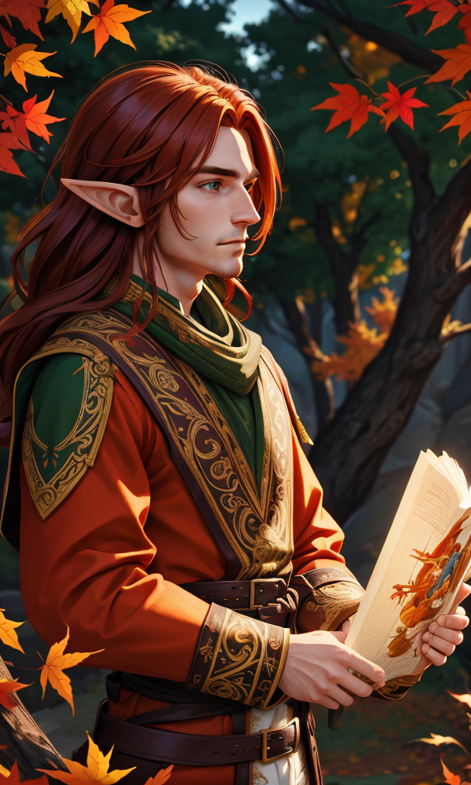

 <table>
  <tr>
    <td rowspan="8"></td>
    <td><b><strong>Stock:</b></strong> Elf</td>
  </tr>
  <tr>
    <td><b><strong>Home:</b></strong>...</td>
  </tr>
    <tr>
    <td><b><strong>Age:</b></strong> 175</td>
  </tr>
    <tr>
    <td><b><strong>Height:</b></strong>...</td>
  </tr>
    <tr>
    <td><b><strong>Weight:</b></strong>...</td>
  </tr>
    <tr>
    <td><b><strong>Features:</b></strong>...</td>
  </tr>
   <tr>
    <td><b><strong>Traits:</b></strong> - Born Under the Silver Stars - Fair and Statuesque - Flatterer - Voice in the Crowd - Essence of the Earth - First Born - Grief - Keen Sight - World Weary - Booming Voice - Perfect Pitch</td>
  </tr>
</table> 

| Beliefs                                                                                                                                                                                                                                                                                                                                                                                          | Instincts                                                                                                                                                                                                                                                                                                                                                                                                                                                                                                                                                          |
| ------------------------------------------------------------------------------------------------------------------------------------------------------------------------------------------------------------------------------------------------------------------------------------------------------------------------------------------------------------------------------------------------ | ------------------------------------------------------------------------------------------------------------------------------------------------------------------------------------------------------------------------------------------------------------------------------------------------------------------------------------------------------------------------------------------------------------------------------------------------------------------------------------------------------------------------------------------------------------------ |
| - I believe it is my purpose, being entuned with grief, to shoulder and alleviate the "grief" of mortals.  - As the mortals of this realm are temporary, I believe those who use what little time they have to treat me well, deserve to be protected.  - It is my duty to my homeland to enshrine the events of the century, so I can return the findings to our elder Loremasters. | - When under stress or anxiety, Thalion instinctively resorts to humming children's songs, a subconscious coping mechanism ingrained from his upbringing.  - Thalion possesses an innate sense of chivalry, always greeting beautiful women with a respectful and gallant gesture - he kisses their hand.  - Thalion's instinct is to sacrificially shield his gift, his singing voice. He prioritizes his safety above all else when his LITERAL head and neck is in danger. When he is in danger, he throws the nearest object or person in the way. |

# Background
An Elf traveling the lands and playing in the locals inns. Currently residing in Blackport and staying at the Oak and Eagle Inn. 

# Relationships
* [[Alden Blackwood]]: The Duke of [[Blackport]]
* [[Maxwell Blackwood]]: The owner of the [[Oak and Eagle Inn]] in [[Blackport]]
