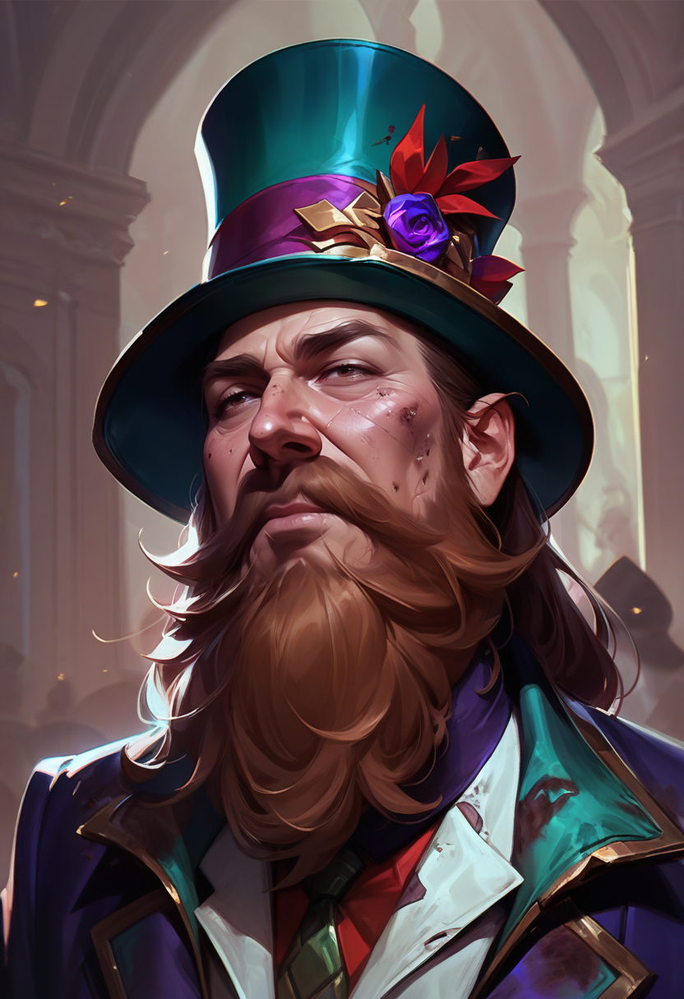

 <table>
  <tr>
    <td rowspan="8"></td>
    <td><b><strong>Stock:</b></strong>...</td>
  </tr>
  <tr>
    <td><b><strong>Home:</b></strong>Blackport (Racinica)</td>
  </tr>
    <tr>
    <td><b><strong>Age:</b></strong>34</td>
  </tr>
    <tr>
    <td><b><strong>Height:</b></strong>...</td>
  </tr>
    <tr>
    <td><b><strong>Weight:</b></strong>...</td>
  </tr>
    <tr>
    <td><b><strong>Features:</b></strong>...</td>
  </tr>
   <tr>
    <td><b><strong>Traits:</b></strong> - Always in the Way - Marked by Lady Fortuna - Misunderstood - Gifted - Impressive Hat - Low Born - Oddly Likable - Tall Tale Teller</td>
  </tr>
</table> 

| Beliefs | Instincts |
| ------- | --------- |
| - This attack on Blackport is an opportunity that I caNNOT MISS I WILL BE ABLE TO HELP PEOPLE AND GET RICH A WIN WIN SO THEY SAY  - obtain money at all costs mONEY IS THE SOURCE OF ALL MY PROBLEMS BUT I LOVE IT SO MUCHG  - Blackport is a city where i might find a cure to my curse  - I am cursed by a fae crature named lady fortuna I always succeed at things for the worse| - I always go for money when presented it  - I feel like I am cursed and things go wrong at the worst time, in times of stress I often panic because things have always gone wrong for me   - I never say no to a good time to my detriment | 

# Background
A Hedge Mage living on the Streets of Blackport. Blessed by the spirit of fortune and making his day's meal by selling the people his wares.

Walks around with his pack donkey Humphry and a seeming inanimate but spirited hat atop his head.