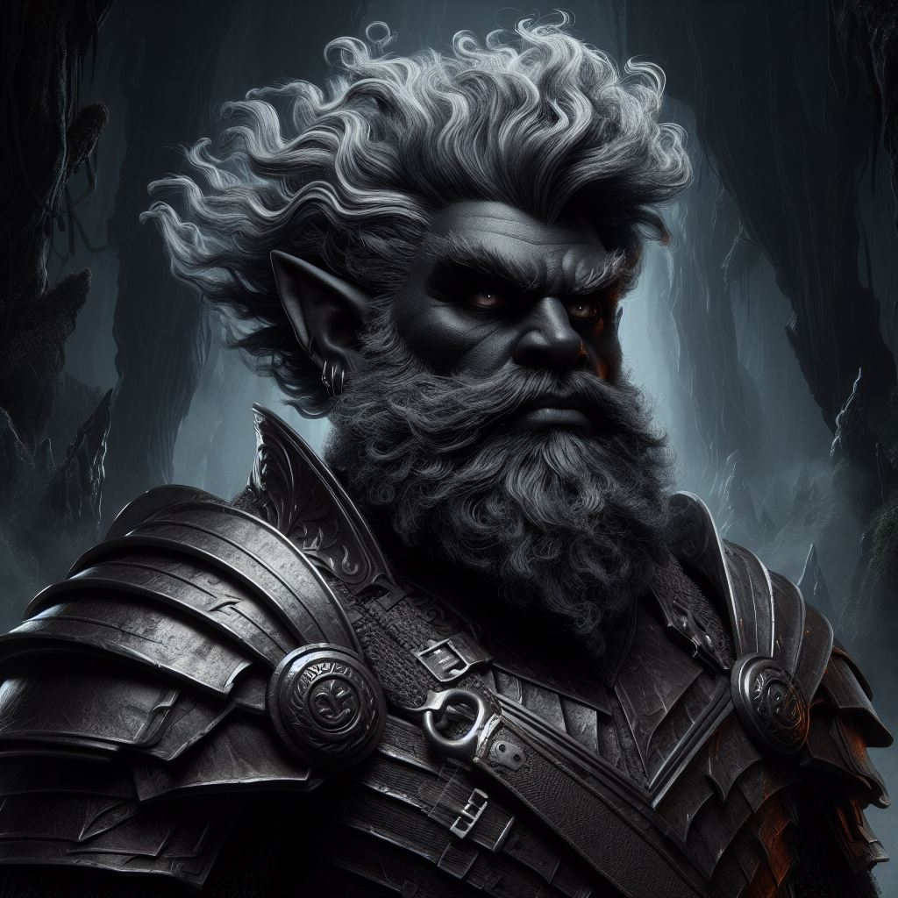

 <table>
  <tr>
    <td rowspan="8"></td>
    <td><b><strong>Stock:</b></strong>Dwarf</td>
  </tr>
  <tr>
    <td><b><strong>Home:</b></strong> Emeraldcrag, Otia</td>
  </tr>
    <tr>
    <td><b><strong>Age:</b></strong> 94</td>
  </tr>
    <tr>
    <td><b><strong>Height:</b></strong>...</td>
  </tr>
    <tr>
    <td><b><strong>Weight:</b></strong>...</td>
  </tr>
    <tr>
    <td><b><strong>Features:</b></strong>...</td>
  </tr>
   <tr>
    <td><b><strong>Beliefs:</b></strong> - Protect my patron's property. - Take what is rightfully mine, the throne of Emeraldcrag. - Earn my Mask. - Prevent disaster for the Dwarves by gaining political power.</td>
  </tr>
   <tr>
    <td><b><strong>Traits:</b></strong> - Bearded - Determined - Humility - Solid - Accustomed to the Dark - Dvergar - Greed - Oathsworn - Shaped from Earth and Stone - Stout - Tough - Virtuous</td>
  </tr>
</table> 

# Background
27th in line for the throne of the Emeraldcrag lineage. With no easy way to secure the throne and of his own lineage, Tyr turned to crafting.

Carries a light axe as a reminder to never settle for poor craftsmanship
# Relationships
* [[Baldor Emeraldcrag]]: Brother to Tyr and __ in line for the Emeraldcrag nobe line
* [[Ferolda Ironmountain]]: Mother, one of the concubines of the current lord of Emeraldcrag
* [[Pinity Ironmountain]]:  Second cousin, owns a workshop in Blackport
* [[Casmira Hill]]: Girlfriend, an outcast Runcaster