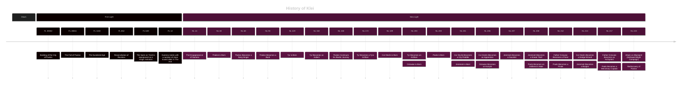

```mermaid
%%{init: { 'logLevel': 'debug', 'theme': 'dark' } }%%
timeline
	title History of Klei
	section Dawn
	section First Light
	FL 30582: Building of the City of Pavlon
	FL 26551: The Fall of Pavlon
	FL 1150: The Sundered Age
	FL 652: Reconciliation of Racinica
	FL 649: The Spire on Trord is repurposed as a magic insitution
	FL 12: Numera meets with a number of close trused allies in The Ash
	section New Light
		NL 14: The Disappearance of Numera
		NL 48: Thalion is Born
		NL 68: Thalion Becomes a Song Singer
		NL 93: Thalion Becomes a Bard
		NL 129: Tyr is Born
		NL 150: Tyr Becomes an Ardent
		NL 158: Thalion Continues his Bardic Journey
		NL 172: Tyr Becomes a Tyro Artificer
		NL 189: Cor Devlin is Born
		NL 193: Tyr Becomes an Artificer
			: Octavian is Born
		NL 200: Paolo is Born 
		NL 201: Cor Devlin Becomes a City Peddler : Jeremiah is Born
		NL 206: Cor Devlin Becomes an Apprentice
			: Octavian Becomes an Acolyte
		NL 207: Jeremiah Becomes a Gauntlet
		NL 208: Jeremiah Becomes a Sneak Thief
			: Paolo Becomes an Artillerist's Mate
		NL 212: Father Octavian Becomes a Priest
			: Paolo Becomes a Pirate
		NL 213: Cor Devlin Becomes a Hedge Wizard
			: Jeremiah Becomes a Burglar
		NL 217: Father Octavian Becomes an Archpriest
			: Paolo Becomes a Mercenary Captain
		NL 223: Attack on Blackport (Hollowed Blight Campaign)
			: Rediscovery of Pavlon
```
